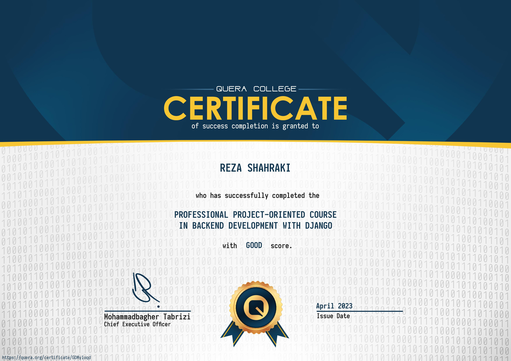
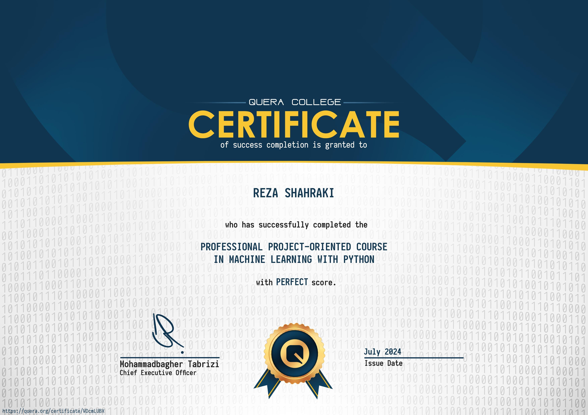
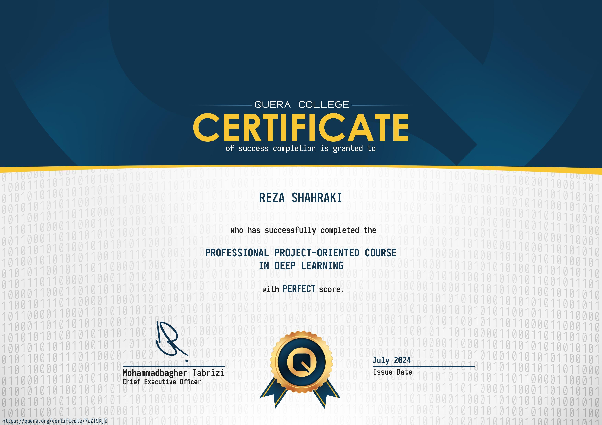

<h1 align="center" style="border: none;">Hi there...👋  I am Omid</h1>

## Personal Information
- **FullName:** Reza Shahraki
- **Specialization:** Artificial intelligence specialist
- **Location:** Shiraz, Iran
- **Born:** 2001-08-08
- **Email:** [hopedeveloper08@gmail.com](mailto:hopedeveloper08@gmail.com)
- **kaggle:** [omid008](https://www.kaggle.com/omid008)

## Skills

### Programming Languages

### AI

### Web Application Development

### Tools

## education:

### Vali-E-Asr Rafsanjan University
Bachelor's in Computer Engineering
2022 - 2025

## Projects

### [CryptoCurrency Exchange](https://github.com/hopedeveloper08/crypto_currency_exchange)

## Certifications

